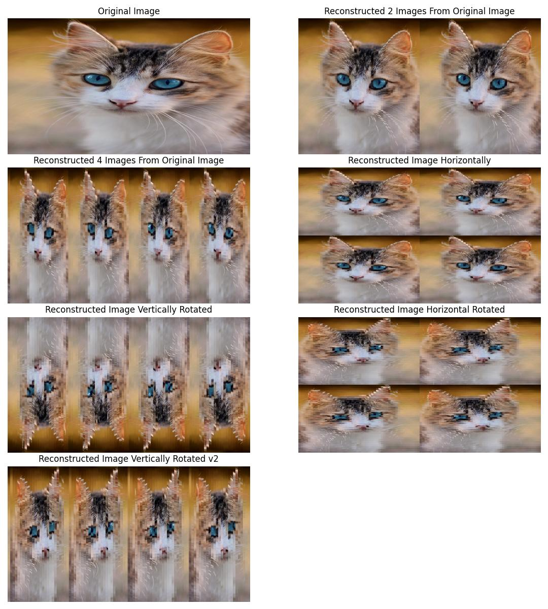
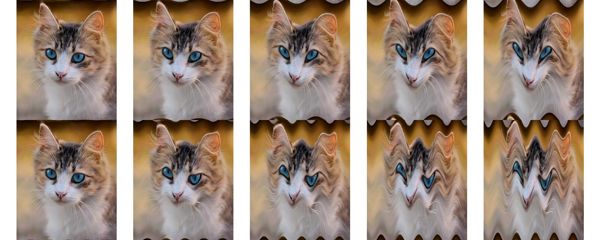

# NUMPY IMAGE RECONSTRUCTION AND DISTORTION

This project focuses on reconstructing images using various approaches in Python with the help of NumPy. It implements 
methods to cut images into strips vertically and horizontally, allows for distortion using sinusoidal wave functions, 
and then reconstructs images from these strips. Additionally, it offers the capability to rotate these strips before 
reconstructing the image.

## Introduction

Image reconstruction is a fundamental task in image processing and computer vision. It involves breaking down an image
into smaller parts, manipulating these parts, and then assembling them back together to form a coherent image. This 
project explores different techniques for image reconstruction using NumPy, including distortion, allowing for 
experimentation with various approaches.

## Features

- Vertical and horizontal image shredding: The script cuts the input image into vertical and horizontal strips.
- Distortion: It provides the option to apply distortion to the image using sinusoidal wave functions, allowing for 
creative effects.
- Rotational capabilities: The project offers the option to rotate the image strips before reconstruction.
- Multiple reconstruction approaches: It offers different strategies for reconstructing images from the shredded strips,
enabling users to explore various reconstruction orders and methods.

## Installation

### Requirements

- Python 3.12
- Requirements listed in [requirements.txt](requirements.txt)

### Usage

1. Clone the repository.
2. Install dependencies in terminal using `pip install -r requirements.txt`.
3. Update [reconstruction_image.py](reconstruction_image.py) with your desired configuration **if needed**.
4. Update [distortions.py](distortions.py) with your desired configuration **if needed**. 
5. Run **[reconstruction_image.py](reconstruction_image.py)** script to initiate for reconstructing images from shredded strips.
6. Run **[distortions.py](distortions.py)**  script to initiate distorting images by applying sinusoidal wave functions.

### Configuration

Before running the `reconstruction_image.py` or `distortions.py` scripts, you may want to adjust certain parameters to 
experiment with different possibilities. If you want to experiment with an existing image, you need to know its 
dimensions. For example, for `cat.jpg`, its dimensions are 533x640 pixels (width x height). These values are important 
if you want to shred the image into very small bits. 

- For vertical shredding, the maximum number of shreds is 533 and the minimum is 4.
- For horizontal shredding, the maximum number of shreds is 640 and the minimum is 2.

If you want to use a different image, ensure that you are aware of its dimensions and adjust the parameters accordingly.

Below are the key configurations you can modify:

#### Reconstruction Image Script (reconstruction_image.py)

1. **Number of Shreds:** You can adjust the `num_shreds` variable to change the number of vertical shreds in the image 
it will only affect `Reconstructed 2 Images From Original Image` and `Reconstructed 4 Images From Original Image`.
2. **Rotation Angle:** If you want to rotate the shredded pieces before reconstruction, you can modify the
`rotation_angle` and `rotation_angle_vertical` variables.
3. **Reconstruction Orders:** The script provides options for defining different reconstruction orders 
(`reconstruct_order_1`, `reconstruct_order_2`, etc.). You can modify these orders to experiment with different 
reconstruction strategies.
4. **Horizontal Shred Parameters:** Similarly, you can adjust the parameters for horizontal shredding, such as 
`num_shreds_horizontal` and `rotation_angle`.
5. **Vertical Shred Parameters:** Likewise, parameters for vertical shredding, like `num_shreds_vertical` and 
`rotation_angle_vertical`, can be modified to experiment with different configurations.

#### Distortions Script (distortions.py)

1. **Orientation:** You can specify the orientation of distortion (horizontal or vertical) by setting the `orientation` parameter.
2. **Wave Function:** The type of wave function used for distortion can be selected by modifying the `func` parameter. 
Options include `np.sin` and `np.cos`.
3. **X-Scale:** Adjust the frequency of the wave function by modifying the `x_scale` parameter. Higher values result 
in more frequent distortions.
4. **Y-Scale:** Control the amplitude of the wave function distortion by adjusting the `y_scale` parameter. Higher 
values lead to more pronounced distortions.

Experiment with these configurations to achieve different effects and results in your image reconstructions or distortions.

## Examples

**[reconstruction_image.py](reconstruction_image.py)**

**[distortions.py](distortions.py)**

## CODE STRUCTURE

### Project02_Numpy_Image _core folder_

* [.gitignore](#gitignore)
* [cat.jpg](#catjpg)
* [distortions.py](#distortionspy)
* [README.md](#readmemd)
* [reconstruction_image.py](#reconstruction_imagepy)
* [requirements.txt](#requirementstxt)
* [result_distorted_cat_images.jpeg](#result_distorted_cat_imagesjpeg)
* [result_reconstructed_cat_images.jpeg](#result_reconstructed_cat_imagesjpeg)

#### [.gitignore](.gitignore)
File to specify files/folders to be ignored by version control

#### [cat.jpg](cat.jpg)
A simple cat that watches at you, what you will do with him

#### [distortions.py](distortions.py)
Script for distorting images using sinusoidal wave functions.

#### [README.md](README.md)
Project documentation

#### [reconstruction_image.py](reconstruction_image.py)
Script for reconstructing images from shredded strips using various approaches.

#### [requirements.txt](requirements.txt)
File listing project dependencies 

#### [result_distorted_cat_images.jpeg](result_distorted_cat_images.jpeg)
Result example by using reconstruction_image.py

#### [result_reconstructed_cat_images.jpeg](result_reconstructed_cat_images.jpeg)
Result example by using distortions.py

## SCRIPT

This project consists of two main scripts:
- `distortions.py`: This script performs image distortion by applying sinusoidal wave functions along either the 
horizontal or vertical axis.
- `reconstruction_image.py`: This script demonstrates techniques for reconstructing images by shredding them into 
smaller pieces and then reconstructing them in various orders.
